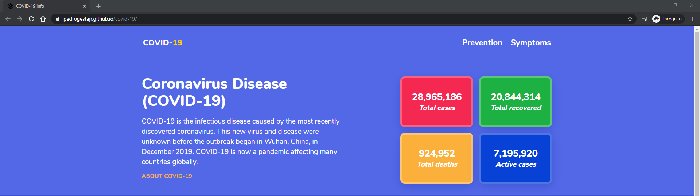

# COVID-Info

A simple project to help spread awareness and basic info about the Coronavirus Disease (COVID-19).

See it live at [https://pedrogestajr.github.io/covid-19/](https://pedrogestajr.github.io/covid-19/)

## Screenshot

## Data Source

[Disease.sh](https://github.com/disease-sh/API) - An open API for disease-related statistics
